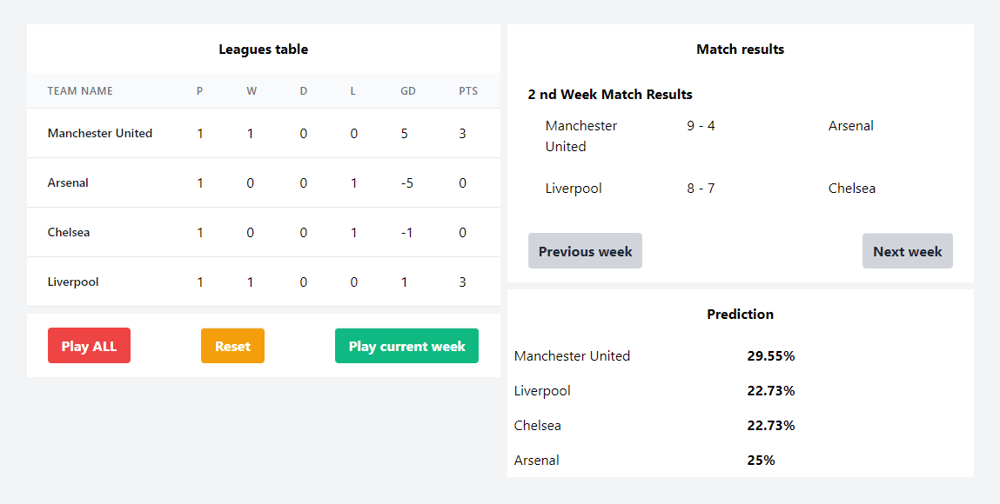

## Premier League Simulation

Simple simulator of premier league.

### DEMO
https://premier-league-simulation.herokuapp.com/

### Installation steps:
0. Clone the repository and do `composer install`
1. Create a .env file based on .env.example file
2. Make sure you have a database in place (with random name)
3. Adapt DB_DATABASE variable on .env file (with name of the one you have created)
4. `php artisan migrate`
5. `php artisan db:seed`
6. Serve the application to run backend `php artisan serve`
7. Install node modules `npm install`
8. Serve frontend `npm run watch` or `npm run dev` to compile assets

### Rules
1. There are four team playing on this Premier League Simulator 
2. Standings are present with 0 default state
3. The whole season (weeks) can be played all each week
4. Reset functionality for getting to the initial state
5. Prediction is done based on team ranking

#### Example screenshots:

